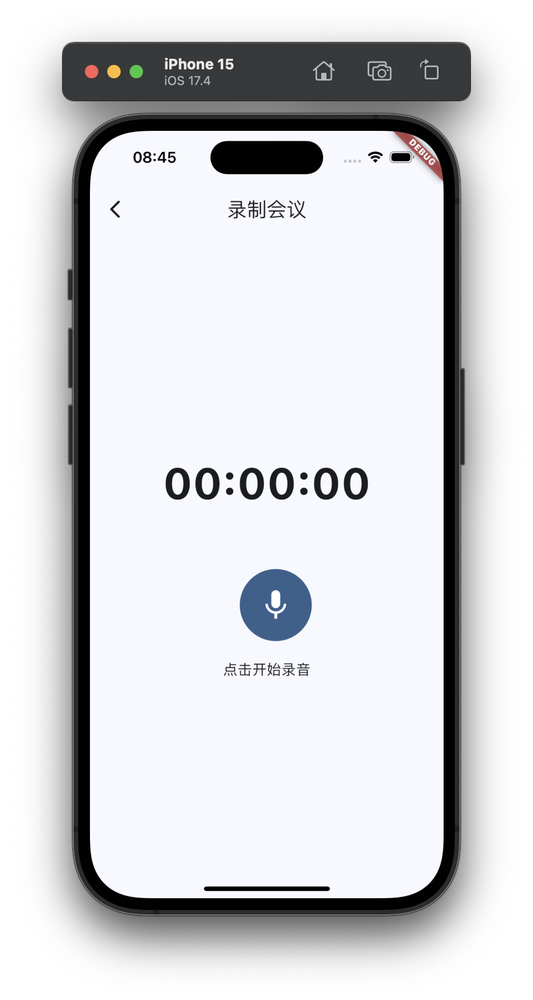
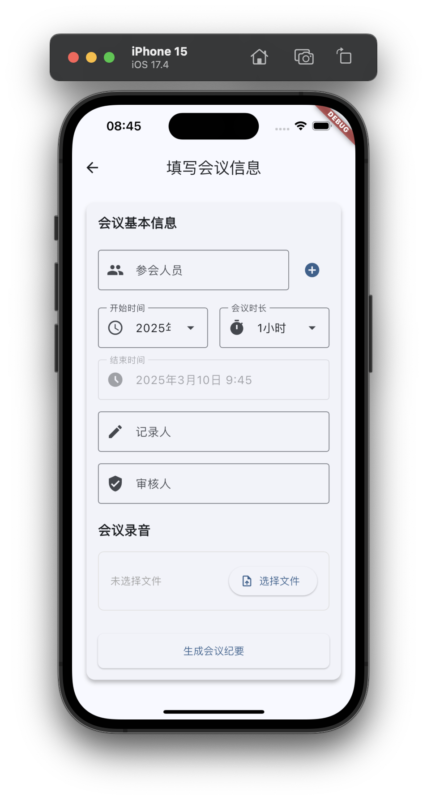

# DeepMeeting App

An AI-powered meeting assistant application.

## Features

- AI-assisted meeting minutes
- Smart meeting summaries 
- Real-time speech-to-text
- Multi-language support

<div style="display: flex; justify-content: space-between;">
  
  
  
  
  
</div>

## TODO
[ ] Add storage and display of original transcription
[ ] Add Tencent Cloud, Google STT API
[ ] Add real-time speech recognition API
[ ] Add automatic recognition and manual options for meeting scenarios, such as political meetings, business meetings, classroom teaching, etc.
[ ] Optimize the progress display during the thinking process
[ ] Add support for recording while locked and background conversion
[ ] Add multilingual support
[ ] Add night mode support

## Development Environment Setup

### Prerequisites

- Flutter SDK
- Dart SDK
- Android Studio / VS Code
- iOS development environment (for iOS builds)

### API Configuration
```bash
cp lib/config/api_config.dart.example lib/config/api_config.dart
```
The default APIs can be configured in the file `lib/config/api_config.dart`, or configured after the app is running. The application requires two types of APIs to run:
1. iFLYTEK's audio transcription API
2. A large model interface compatible with OpenAI's interface (DeepSeek is used for development and testing).

### Generate Launcher Icons & App Name
Use [flutter_launcher_icons](https://pub.dev/packages/flutter_launcher_icons) configuration file `flutter_launcher_icons.yaml`
Run `dart run flutter_launcher_icons` command to generate icons

Use [package_rename](https://pub.dev/packages/package_rename) plugin to generate app name
Configuration file: `package_rename_config.yaml`
Command: `dart run package_rename`