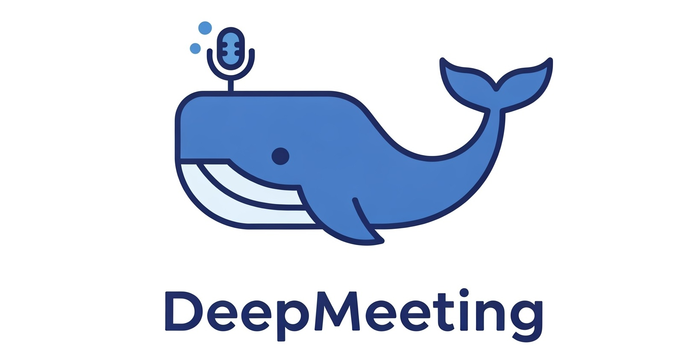
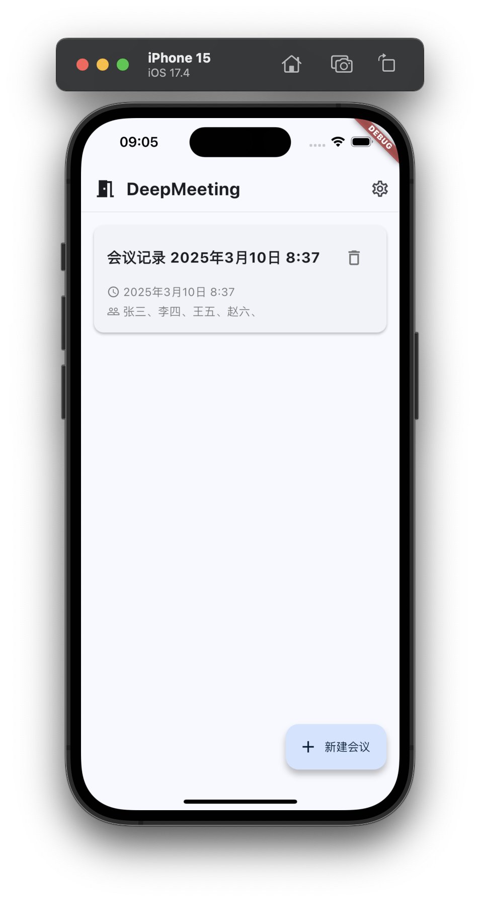
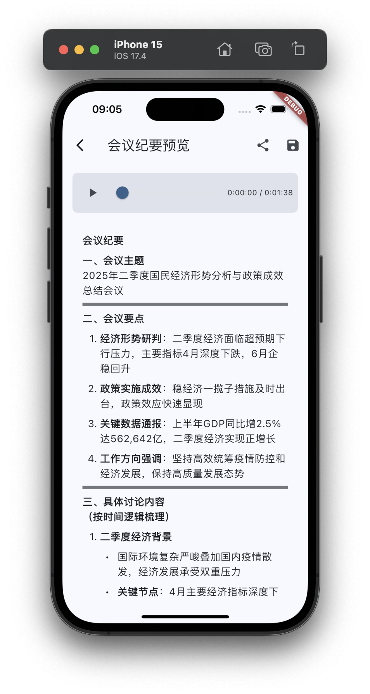
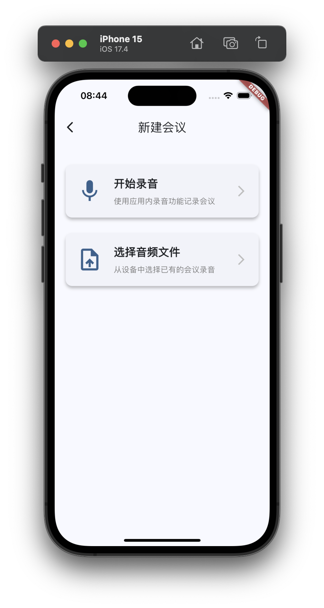
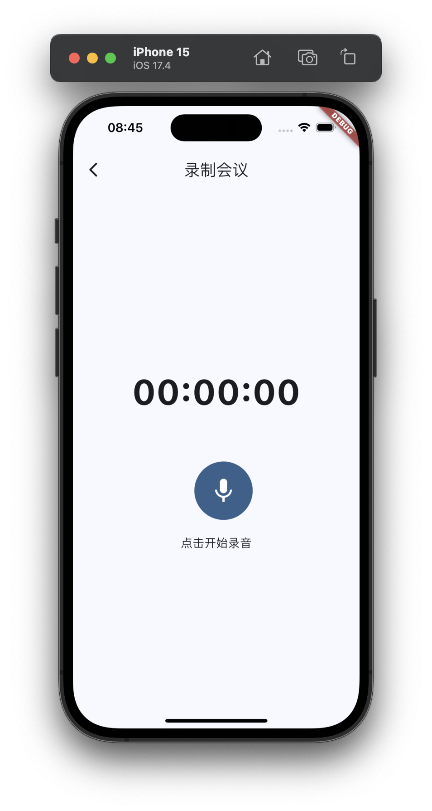
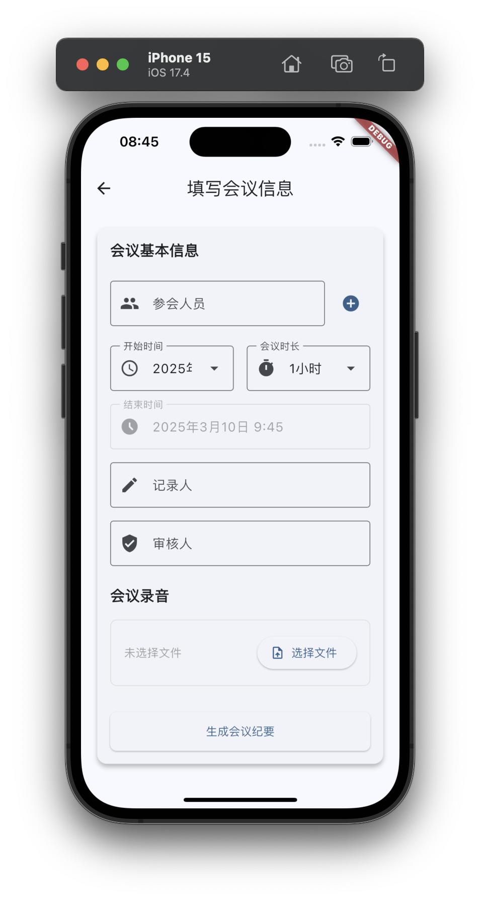

# DeepMeeting App

一个基于 AI 的会议助手应用。

## 功能特点

- AI 辅助会议记录
- 智能会议总结
- 实时语音转文字
- 多语言支持

## 开发环境配置

### 前置要求

- Flutter SDK
- Dart SDK
- Android Studio / VS Code
- iOS 开发环境 (用于 iOS 构建)

<div style="display: flex; justify-content: space-between;">
  
  
  
  
  
</div>

### API 配置文件
```bash
cp lib/config/api_config.dart.example lib/config/api_config.dart
```
可在文件 lib/config/api_config.dart 中对默认的 API 进行配置，或 APP 运行后再进行配置。
应用运行需要两种类型的 API：
1. 科大讯飞的音频转录 API
2. 兼容 OpenAI 接口的大模型接口（开发和测试使用的 DeepSeek）。

### 生成启动器图标 & 应用名称
使用 [flutter_launcher_icons](https://pub.dev/packages/flutter_launcher_icons) 配置文件 `flutter_launcher_icons.yaml`
使用 `dart run flutter_launcher_icons` 命令生成图标

使用 [package_rename](https://pub.dev/packages/package_rename) 插件生成应用名称
配置文件：`package_rename_config.yaml`
命令 `dart run package_rename`